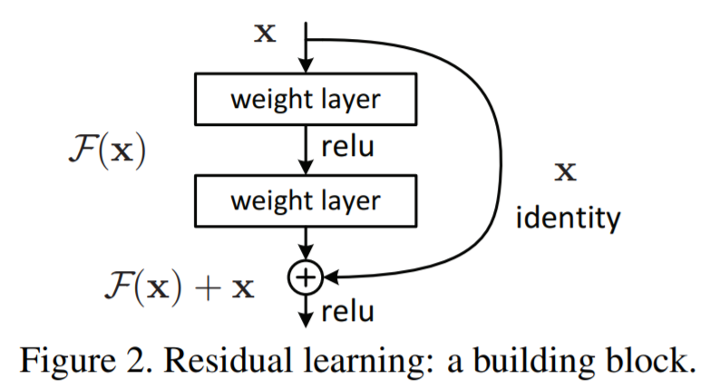
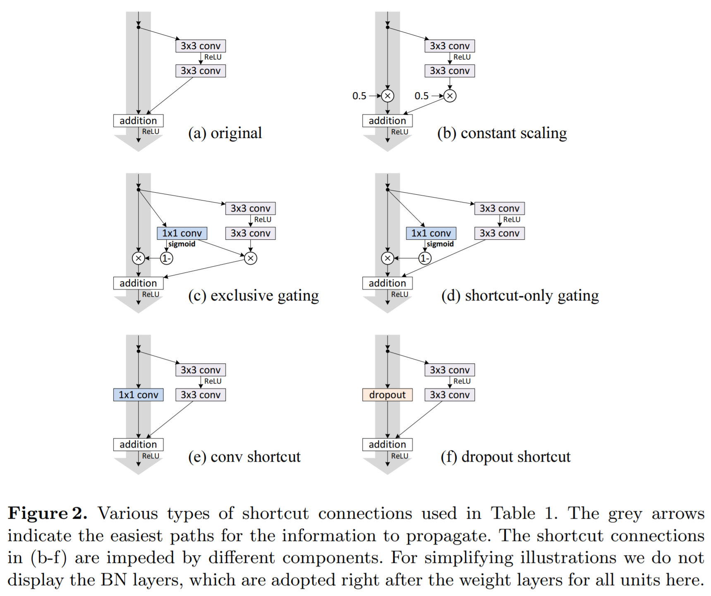
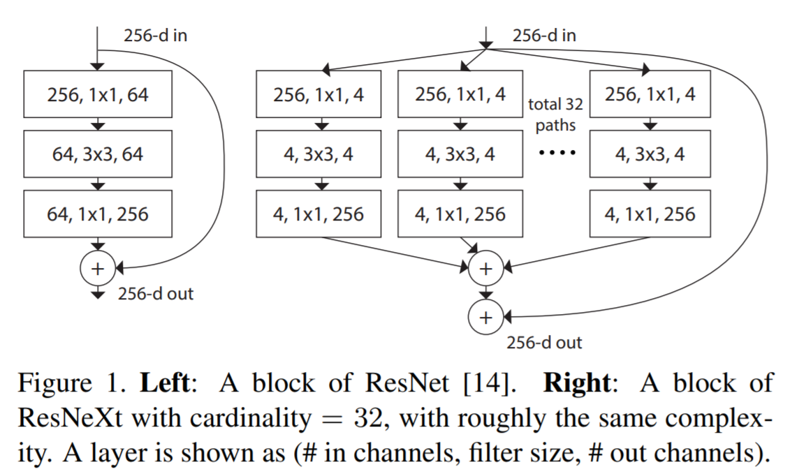
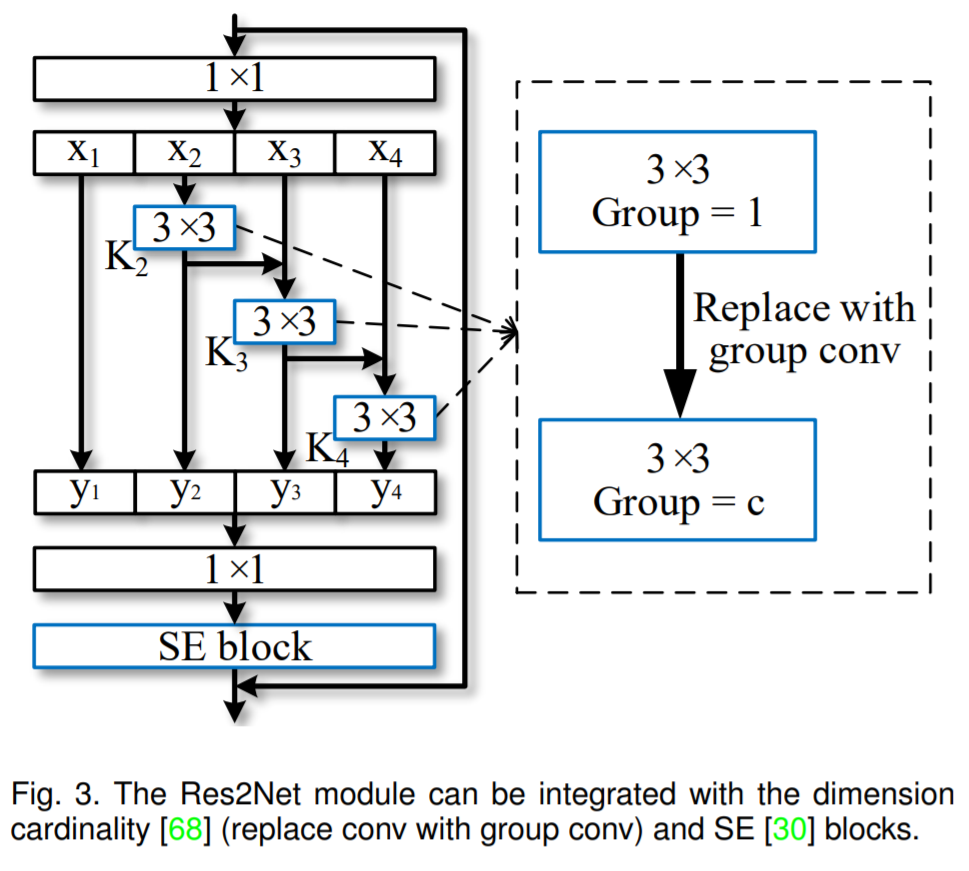

# ResNet

## [Deep Residual Learning for Image Recognition](https://arxiv.org/pdf/1512.03385.pdf)
- Authors: Kaiming He, Xiangyu Zhang, Shaoqing Ren, Jian Sun
- Affiliations: Microsoft Research
- Publisher: CVPR, 2016  

### Abstract
Deeper neural networks are more difficult to train. We present a residual learning framework to ease the training of networks that are substantially deeper than those used previously. We explicitly reformulate the layers as learning residual functions with reference to the layer inputs, instead of learning unreferenced functions. We provide comprehensive empirical evidence showing that these residual networks are easier to optimize, and can gain accuracy from considerably increased depth. On the ImageNet dataset we evaluate residual nets with a depth of up to 152 layers—8× deeper than VGG nets but still having lower complexity. An ensemble of these residual nets achieves 3.57% error on the ImageNet test set. This result won the 1st place on the ILSVRC 2015 classification task. We also present analysis on CIFAR-10 with 100 and 1000 layers.  
The depth of representations is of central importance for many visual recognition tasks. Solely due to our extremely deep representations, we obtain a 28% relative improvement on the COCO object detection dataset. Deep residual nets are foundations of our submissions to ILSVRC & COCO 2015 competitions1 , where we also won the 1st places on the tasks of ImageNet detection, ImageNet localization, COCO detection, and COCO segmentation.

## [Identity Mappings in Deep Residual Networks](https://arxiv.org/pdf/1603.05027.pdf)
- Authors: Kaiming He, Xiangyu Zhang, Shaoqing Ren, and Jian Sun
- Affiliations: Microsoft Research
- Publisher: ECCV, 2016  

### Abstract
Deep residual networks [1] have emerged as a family of extremely deep architectures showing compelling accuracy and nice convergence behaviors. In this paper, we analyze the propagation formulations behind the residual building blocks, which suggest that the forward and backward signals can be directly propagated from one block to any other block, when using identity mappings as the skip connections and after-addition activation. A series of ablation experiments support the importance of these identity mappings. This motivates us to propose a new residual unit, which makes training easier and improves generalization. We report improved results using a 1001-layer ResNet on CIFAR-10 (4.62% error) and CIFAR-100, and a 200-layer ResNet on ImageNet. Code is available at: https://github.com/KaimingHe/resnet-1k-layers.

## [Aggregated Residual Transformations for Deep Neural Networks](https://arxiv.org/pdf/1611.05431.pdf)
- Authors: Saining Xie, Ross Girshick, Piotr Dollár, Zhuowen Tu, Kaiming He
- Affiliations: UC San Diego, Facebook AI Research
- Publisher: CVPR, 2017  

### Abstract
We present a simple, highly modularized network architecture for image classification. Our network is constructed by repeating a building block that aggregates a set of transformations with the same topology. Our simple design results in a homogeneous, multi-branch architecture that has only a few hyper-parameters to set. This strategy exposes a new dimension, which we call "cardinality" (the size of the set of transformations), as an essential factor in addition to the dimensions of depth and width. On the ImageNet-1K dataset, we empirically show that even under the restricted condition of maintaining complexity, increasing cardinality is able to improve classification accuracy. Moreover, increasing cardinality is more effective than going deeper or wider when we increase the capacity. Our models, named ResNeXt, are the foundations of our entry to the ILSVRC 2016 classification task in which we secured 2nd place. We further investigate ResNeXt on an ImageNet-5K set and the COCO detection set, also showing better results than its ResNet counterpart. The code and models are publicly available online.

## [Res2Net: A New Multi-scale Backbone Architecture](https://arxiv.org/pdf/1904.01169.pdf)
- Authors: Shang-Hua Gao, Ming-Ming Cheng, Kai Zhao, Xin-Yu Zhang, Ming-Hsuan Yang, Philip Torr
- Affiliations: Nankai University, UC Merced, Oxford University
- Publisher: IEEE Transactions on Pattern Analysis and Machine Intelligence 

### Abstract
Representing features at multiple scales is of great importance for numerous vision tasks. Recent advances in backbone convolutional neural networks (CNNs) continually demonstrate stronger multi-scale representation ability, leading to consistent performance gains on a wide range of applications. However, most existing methods represent the multi-scale features in a layer-wise manner. In this paper, we propose a novel building block for CNNs, namely Res2Net, by constructing hierarchical residual-like connections within one single residual block. The Res2Net represents multi-scale features at a granular level and increases the range of receptive fields for each network layer. The proposed Res2Net block can be plugged into the state-of-the-art backbone CNN models, e.g., ResNet, ResNeXt, and DLA. We evaluate the Res2Net block on all these models and demonstrate consistent performance gains over baseline models on widely-used datasets, e.g., CIFAR-100 and ImageNet. Further ablation studies and experimental results on representative computer vision tasks, i.e., object detection, class activation mapping, and salient object detection, further verify the superiority of the Res2Net over the state-of-the-art baseline methods. 

