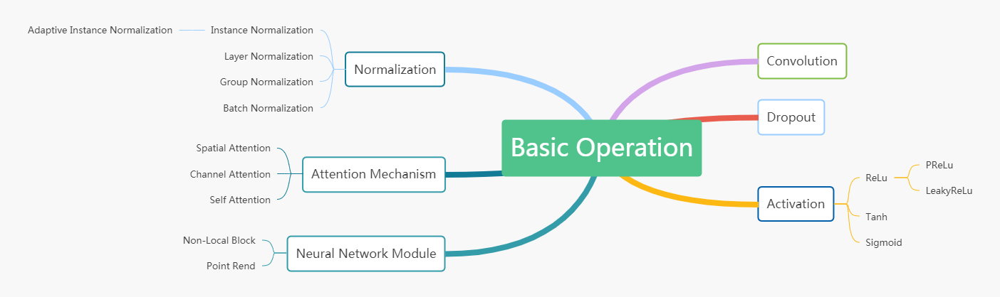
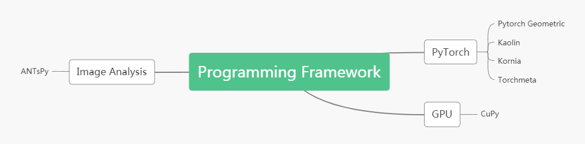

# LearningNote
> A record of my course for deep learning

## [Basic Operation](Operation/Operation_summary.md)
> Contents of the basic operation in deep learning.  
  
  

## [Programming Framework](Programming/Library_summary.md)
> Contents of the programming framework for machine learning and medical image computing.  

  

## Papers
> Paper list for deep learning in computer vision and medical image computing. 

### Summary, Survey and Review
- **Deep Learning**   
  *Nature* (2015). [[Paper]](https://www.nature.com/articles/nature14539)
  > From Yann LeCun, Yoshua Bengio, Geoffrey Hinton.
- **Deep Learning for Cardiac Image Segmentation: A Review**  
  *Frontiers in Cardiovascular Medicine* (2020). [[Paper]](https://www.ncbi.nlm.nih.gov/pmc/articles/PMC7066212/)
  > From Chen Chen1 (ICL) and Daniel Rueckert* (ICL)
- **Bag of Tricks for Image Classification with Convolutional Neural Networks**  
  *CVPR* (2019). [[Paper]](https://arxiv.org/pdf/1812.01187v2.pdf)
  > From Tong He1 (AWS) and Mu Li* (AWS)

### Recognition
- **Focus Longer to See Better: Recursively Refined Attention for Fine-Grained Image Classification**  
  *ArXiv* (2020). [[Paper]](https://arxiv.org/pdf/2005.10979.pdf) [[Code]](https://github.com/TAMU-VITA/Focus-Longer-to-See-Better)
  > From Prateek Shroff1 (Texas A&M Univ.) and Zhangyang Wang* (Texas A&M Univ.)

### Registration
- **An Unsupervised Learning Model for Deformable Medical Image Registration**  
  *CVPR* (2018). [[Paper]](https://arxiv.org/abs/1802.02604) [[Code]](https://github.com/voxelmorph/voxelmorph)
  > From Balakrishnan, Guha1 (MIT) and Adrian V. Dalca* (MIT&MGH).
  
### Segmentation
- **Cars Can’t Fly up in the Sky: Improving Urban-Scene Segmentation via Height-driven Attention Networks**  
  *CVPR* (2020). [[Paper]](https://arxiv.org/pdf/2003.05128.pdf) [[Code]](https://github.com/shachoi/HANet)
  > From Sungha Choi1 (Korea Univ.) and Jaegul Choo* (KAIST).
- **Learning Active Contour Models for Medical Image Segmentation**  
  *CVPR* (2019). [[Paper]](http://openaccess.thecvf.com/content_CVPR_2019/papers/Chen_Learning_Active_Contour_Models_for_Medical_Image_Segmentation_CVPR_2019_paper.pdf) [[Code]](https://github.com/xuuuuuuchen/Active-Contour-Loss)
  > From Xu Chen1 (Univ. of Liverpool) and Yalin Zheng* (Univ. of Liverpool).

### Plane Localization
- **Automatic View Planning with Multi-scale Deep Reinforcement Learning Agents**   
  *MICCAI* (2018). [[Paper]](https://arxiv.org/pdf/1806.03228.pdf) [[Code]](https://git.io/vhuMZ)  
  > From Amir Alansary1 (ICL) and Daniel Rueckert* (ICL)  
- **Ultrasound Video Summarization using Deep Reinforcement Learning**  
  *MICCAI* (2020). [[Paper]](https://arxiv.org/pdf/2005.09531.pdf)
  > From Tianrui Liu1 (ICL) and Bernhard Kainz* (ICL)

### Blending
- **GP-GAN: Towards Realistic High-Resolution Image Blending**  
  *ACMMM* (2019). [[Paper]](https://arxiv.org/pdf/1703.07195.pdf) [[Code]](https://github.com/wuhuikai/GP-GAN)  
  > From Huikai Wu1 (CASIA) and Kaiqi Huang* (CASIA).

